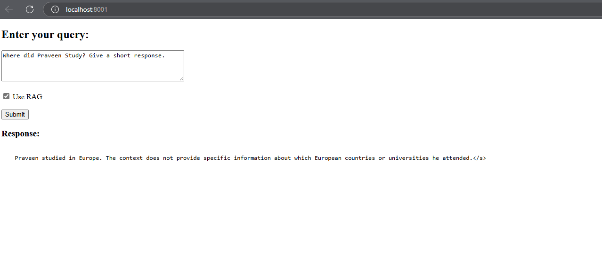

# Mistral-Powered Chatbot with Retrieval Augmented Generation (RAG)

This repository provides a chatbot application built using the Mistral language model (future iterations may explore smaller, more efficient models). It leverages Retrieval Augmented Generation (RAG) to enhance the chatbot's responses with relevant information from external data sources.

## Features

* **Mistral Model Integration:** Utilizes the powerful Mistral language model for generating conversational responses.
* **Retrieval Augmented Generation (RAG):** Integrates external data retrieval to provide contextually relevant and accurate answers.
* **Toggleable RAG:** Allows users to switch between using and bypassing RAG for comparison and flexibility.
* **FastAPI Web Interface:** Provides a simple HTML interface through a FastAPI application for easy interaction.
* **Dockerized Deployment:** Offers a Docker image for streamlined deployment and portability.

## Getting Started

### Prerequisites

* Docker (recommended)
* Python 3.x (if running without Docker)

### Docker Deployment (Recommended)

1.  **Build or Pull the Docker Image:**

    * To build the image locally:

        ```bash
        docker build -t llama_index_image:light .
        ```

    * To pull the pre-built image from Docker Hub:

        ```bash
        docker pull praveenkumar2909/llama_index_image:light
        ```

2.  **Run the Docker Container:**

    * Execute the following command to start the FastAPI application:

        ```bash
        docker run -p 8000:8000 llama_index_image:light
        ```

3.  **Access the Web Interface:**

    * Open your web browser and navigate to the displayed address (likely `http://127.0.0.1:8000`).

### Running Without Docker (Python)

1.  **Install Dependencies:**

    * Install the required Python packages using pip. (See the requirements.txt file)

        ```bash
        pip install -r requirements.txt
        ```

2.  **Run the FastAPI Application:**

    * Execute the following command in your terminal:

        ```bash
        fastapi run app_fast.py --port 8000
        ```

3.  **Access the Web Interface:**

    * Open your web browser and navigate to the displayed address (likely `http://127.0.0.1:8000`).

### Using the Chatbot

* Once the web interface is loaded, enter your query in the provided text field.
* Use the toggle option to enable or disable RAG.
* Click the "Submit" button to send your query and receive a response.

**Sample Interface:**



## Performance Notes

* The chatbot's response time may be slow, particularly on systems with limited computational resources.
* This sl